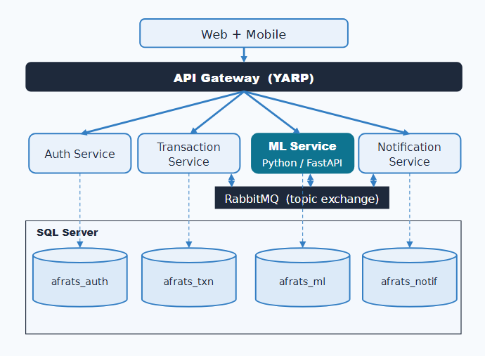

# AI-Based Financial Anomaly Detection and Risk Scoring System with Microservices Architecture (AFRATS)

### A Dual-Task Ensemble Learning Approach with Event-Driven Communication

AFRATS is a microservices-based system that detects financial anomalies and scores user risk through an ensemble-learning pipeline. It is composed of 5 independently deployable services that communicate asynchronously over an event-driven RabbitMQ bus.

📄 [Full Thesis (PDF)](docs/thesis.pdf)

## Problem & Motivation

Financial anomaly detection and risk scoring are hard for a single algorithm to get right on its own. AFRATS treats them as two related problems, anomaly detection and risk scoring, each solved with an ensemble rather than one model. A rule-based layer sits on top of the ML output, using signals like income-to-expense ratio to explain why a user is risky, not just flag that they are. This ensemble-plus-rules design maps naturally onto a microservices architecture, letting each service scale, deploy, and update independently, the same pattern real fintech systems use — and it lets AFRATS plug into a real data source, like a bank integration, later on.

## Architecture Overview

AFRATS is split into 5 independently deployable services, each with its own database, communicating asynchronously instead of through direct calls. The .NET services follow Clean Architecture, separated into Domain, Application, Infrastructure, and API layers.



| Service | Responsibility |
|---|---|
| **API Gateway** (YARP) | Single entry point for the web and mobile clients, routes requests to the right service |
| **AuthService** | Registration, login, JWT access + refresh token rotation |
| **TransactionService** | Stores and serves transaction data |
| **MLService** (Python, FastAPI) | Runs the ML ensembles and the rule-based override layer |
| **NotificationService** | Alerts users when a transaction is flagged or a user is marked risky |

Services communicate through **RabbitMQ**: TransactionService publishes an event on a new transaction, MLService consumes it and publishes a result, NotificationService listens for flagged transactions and risky users — no service calls or waits on another directly.

**Why microservices + event-driven:** Microservices and event-driven communication together keep ML processing separate from transaction processing. If MLService is slow or down, the event just waits in the queue instead of blocking the rest of the system — and because each service is independent, it can also be scaled and updated on its own, without touching the others.

The full system runs as 7 Docker containers (5 services + RabbitMQ + SQL Server), with a React web client and a React Native mobile client on top. The complete flow — from transaction creation to ML analysis to notification — is fully operational end to end.

## Results

Real financial datasets are either not publicly available or have poor label quality, so AFRATS uses a synthetic dataset of 694,327 transactions from 2,000 users (7% label noise, 4.66% anomaly rate). Generating the data gives full control over labeling and enables a clean, reproducible evaluation.

**Anomaly Detection** (ensemble: Z-Score 0.30, Isolation Forest 0.20, LOF 0.05, XGBoost 0.45)

| Metric | Score |
|---|---|
| F1 | 0.813 |
| Precision | 0.733 |
| Recall | 0.914 |
| MCC | 0.809 |

**Risk Classification** (ensemble: XGBoost 0.70, Random Forest 0.20, Logistic Regression 0.10)

| Metric | Score |
|---|---|
| Accuracy | 81.25% |
| Macro F1 | 0.761 |

The anomaly ensemble beats XGBoost alone (F1 0.765) since the four detectors make different errors. The risk ensemble shows no such gain — the three classifiers learn similar patterns, leaving little to combine.

## Tech Stack

**Backend**
- .NET 10 (C#) — Clean Architecture (Domain, Application, Infrastructure, API), MediatR (CQRS)
- Python, FastAPI
- YARP — API Gateway
- JWT — access + refresh token auth

**Data & Messaging**
- SQL Server 2022 — each service has its own dedicated database
- RabbitMQ — event-driven communication between services

**Clients**
- React 19, Vite, Tailwind CSS — web client
- Expo / React Native, TypeScript — mobile client

**Infrastructure**
- Docker Compose — full-stack orchestration

## Getting Started

**Prerequisites:** Docker, Docker Compose, Expo Go (for mobile)

```bash
git clone <repo-url>
cd afrats
cp .env.example .env   # fill in your own values
docker compose up
```

This starts 7 containers: Gateway, AuthService, TransactionService, MLService, NotificationService, RabbitMQ, and SQL Server.

| Service | URL |
|---|---|
| API Gateway | `http://localhost:5000` |
| AuthService | `http://localhost:5001` |
| TransactionService | `http://localhost:5002` |
| MLService | `http://localhost:8000` |
| NotificationService | `http://localhost:5003` |
| RabbitMQ Management | `http://localhost:15672` |
| SQL Server | `localhost:14333` |

**Web client:**
```bash
cd web/afrats-web
npm install
npm run dev
```

**Mobile client:**
```bash
cd mobile/afrats-mobile
npx expo start
```
Scan the QR code with Expo Go.

## License

MIT — see [LICENSE](LICENSE) for details.
